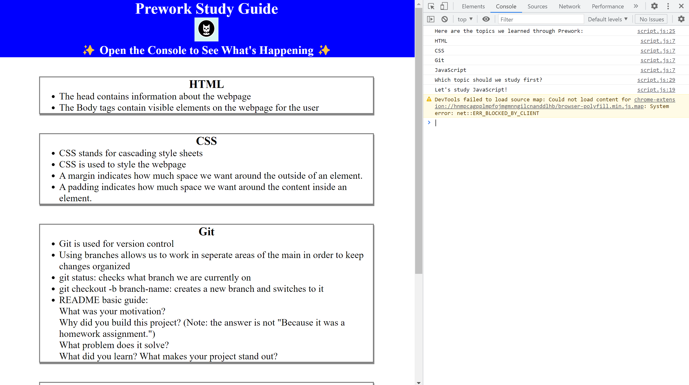

# Prework Study Guide Application

## Description

I created this web page to help bootcamp students study notes during the program. This web page makes it easy to find and read useful notes. It contains basics of HTML, CSS, JavaScript, Git, and Markdown.

## Installation

N/A

## Usage

Each section on this web page lists notes for HTML, CSS, JavaScript, and Git. Additionally, open Dev tools using `ctrl+shift+i` in your browser to view additional information and what js is doing behind the scenes.

## Credits

N/A

## License

This web page is developed under the MIT license.